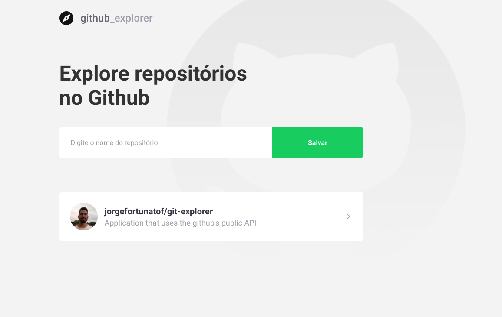

# 🧭 Git Explorer 

Application that uses the github's public API to explore any repository from github and see all the forks, stars and open issues. 
You can access it clicking [here](https://naughty-yonath-c176e0.netlify.app/).
